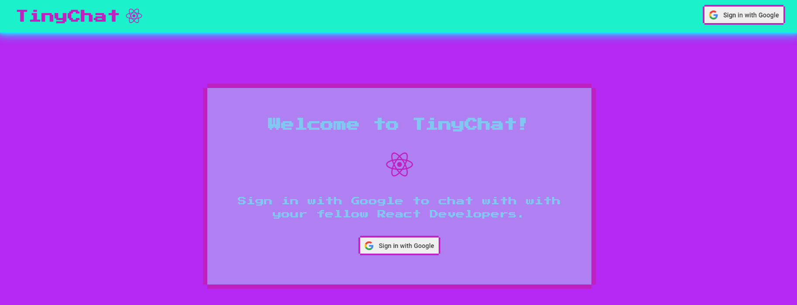

# 📨 TinyChat (React Version)

A simple persistent chat app built with ReactJS and Firebase. 
 

📨 [GitHub Repo]("https://github.com/LiliCecilia23/TinyChat")

📨 [Deployed App]("https://lilicecilia23.github.io/TinyChat/")

## Usage Instructions
From the home page, users are prompted to sign in with their Google account. Once successfully logged in, the app will automatically navigate the user to the chat page. Chats are displayed in the order they are received to the app. Users can use the input field at the bottom of the page to send new chats.

## Technologies Used 
* React
* Firebase
* CSS3 
* JavaScript 

## Contact
* [LinkedIn]("linkedin.com/in/lili-clift/")
* [GitHub]("github.com/LiliCecilia23")

## License 
Copyright (c) 2024 Lili Clift Licensed under the MIT license.